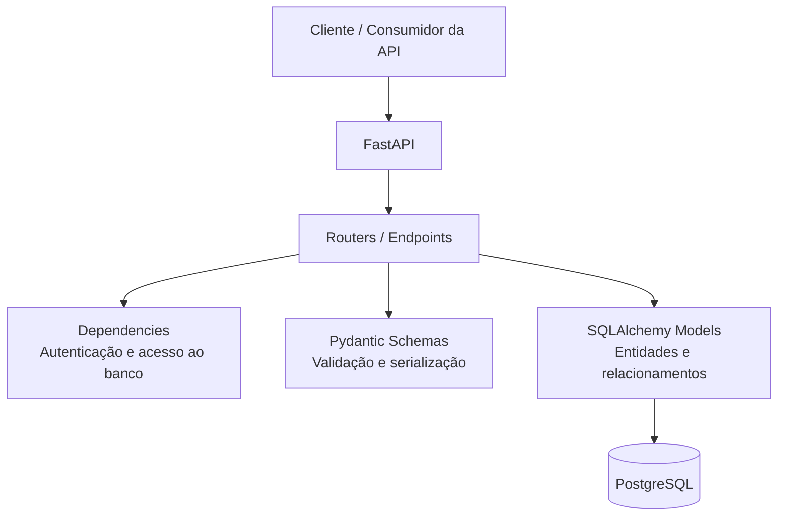
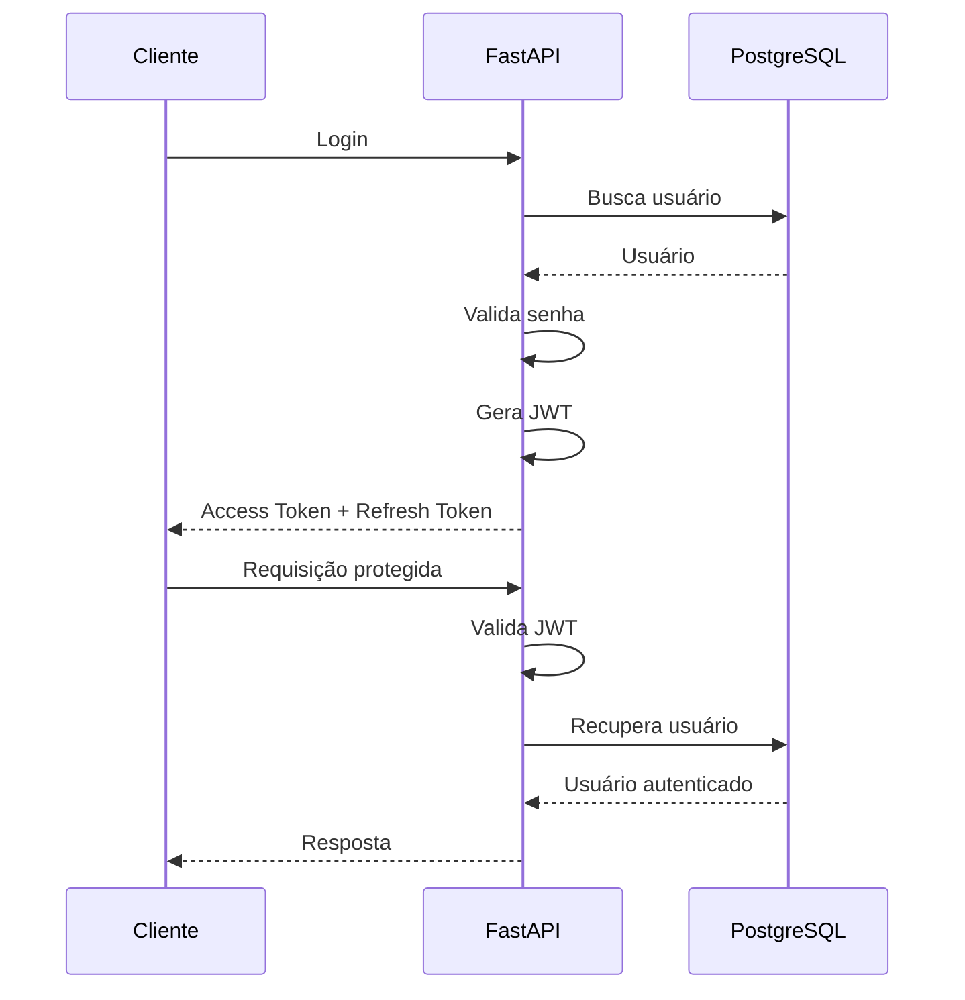
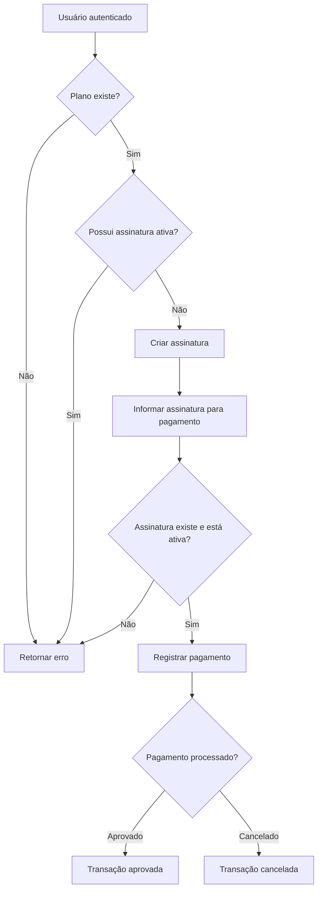
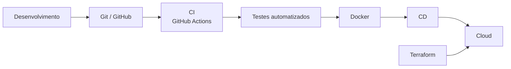

# 💳 Simulador de Cobranças

<p align="center">
  API REST desenvolvida com Python e FastAPI para simulação de um sistema de
  assinaturas, cobranças e pagamentos, com autenticação, controle de acesso,
  relatórios e testes automatizados.
</p>

<p align="center">


</p>

---

## 📌 Sobre o projeto

O **Simulador de Cobranças** é uma API REST desenvolvida para representar o fluxo de um sistema de cobrança baseado em planos, assinaturas e transações financeiras.

A aplicação permite o gerenciamento de usuários, autenticação, permissões administrativas, planos, assinaturas, pagamentos simulados e relatórios.

O projeto foi desenvolvido com foco não apenas na implementação dos endpoints, mas também na aplicação prática de conceitos de:

- Arquitetura de APIs REST;
- Autenticação e autorização;
- Modelagem relacional;
- ORM;
- Validação de dados;
- Regras de negócio;
- Tratamento de erros;
- Testes automatizados;
- Migrations de banco de dados;
- Containerização;
- Integração contínua;
- Organização e documentação de código.

---

## 🎯 Objetivos

O projeto tem como objetivo simular, de forma prática, a estrutura de um backend utilizado em uma aplicação de cobranças.

Entre os principais objetivos estão:

- Implementar autenticação segura;
- Controlar diferentes níveis de acesso;
- Permitir o gerenciamento de planos;
- Controlar assinaturas dos usuários;
- Simular o processamento de pagamentos;
- Disponibilizar relatórios de cobrança;
- Garantir o funcionamento das regras de negócio através de testes automatizados;
- Utilizar migrations para controle da estrutura do banco;
- Executar testes automaticamente através de CI;
- Preparar a aplicação para deploy e evolução em ambiente cloud.

---

## ✨ Funcionalidades

### 👤 Usuários

- Cadastro de usuários;
- Validação de dados;
- Validação de senha;
- Login;
- Autenticação com JWT;
- Refresh token rotativo;
- Edição de dados;
- Alteração de senha;
- Ativação e desativação de usuários;
- Gerenciamento de administradores.

### 🔐 Autenticação e autorização

A aplicação utiliza **JWT (JSON Web Token)** para autenticação.

O acesso aos endpoints protegidos é realizado através do header:

```text
Authorization: Bearer <token>
```

Além da autenticação, existem regras de autorização para operações administrativas.

Determinados recursos, como gerenciamento de planos, consulta de clientes, transações e relatórios, são restritos a usuários administradores.

---

## 💰 Sistema de cobranças

O fluxo principal da aplicação é baseado na relação:

```text
Usuário
   │
   ▼
Plano
   │
   ▼
Assinatura
   │
   ▼
Pagamento
   │
   ▼
Transação
```

Um usuário pode possuir uma assinatura ativa vinculada a um plano existente.

Antes da criação ou alteração de uma assinatura, a aplicação valida as regras de negócio relacionadas ao usuário, plano e estado da assinatura.

Entre as validações implementadas estão:

- Plano inexistente;
- Usuário inexistente;
- Assinatura ativa já existente;
- Assinatura inexistente;
- Assinatura já cancelada;
- Assinatura inativa durante o registro de pagamento.

---

## 🏗️ Arquitetura

A aplicação segue uma arquitetura organizada por responsabilidades, separando rotas, modelos, schemas, dependências e testes.



A separação das responsabilidades permite que as diferentes partes da aplicação evoluam de forma independente e facilita a manutenção e evolução do código.

---

## 🔄 Fluxo de autenticação



---

## 🔄 Fluxo de assinatura e pagamento



---

## 📚 Documentação técnica

A documentação detalhada do projeto está disponível no diretório [`docs/`](./docs).

A documentação inclui:

- 📋 Requisitos do sistema;
- 🔄 Fluxogramas;
- 🎨 Design da aplicação;
- 🏗️ Documentação de arquitetura;
- 📐 Modelagem e decisões de projeto.

A documentação foi mantida separada do código-fonte para manter o README como uma visão geral da aplicação e permitir uma análise mais aprofundada dos artefatos de projeto.

---

## 🧪 Testes automatizados

O projeto possui uma suíte de testes desenvolvida com **Pytest**, cobrindo principalmente autenticação, usuários, permissões, planos, assinaturas, pagamentos e relatórios.

### Resultado atual

```text
36 passed
```

Os testes incluem cenários de sucesso e erro, como:

- Cadastro válido e inválido;
- Senhas inválidas;
- Autenticação;
- Refresh token;
- Alteração de dados;
- Alteração de senha;
- Permissões administrativas;
- Criação de planos;
- Atualização de planos;
- Tentativa de utilizar plano inexistente;
- Criação de assinatura;
- Tentativa de criar assinatura duplicada;
- Atualização de assinatura;
- Cancelamento;
- Tentativa de cancelar assinatura já cancelada;
- Pagamentos;
- Assinaturas inexistentes ou inativas;
- Consultas administrativas;
- Relatórios.

Para executar os testes:

```bash
pytest
```

---

## 🐳 Containerização

A aplicação possui um `Dockerfile` para permitir a execução do backend em um ambiente containerizado.

A containerização tem como objetivo padronizar o ambiente de execução e facilitar futuras etapas de deploy e integração com serviços de infraestrutura.

---

## ⚙️ Integração Contínua

O projeto utiliza **GitHub Actions** para automação do processo de integração contínua.

O workflow está localizado em:

```text
.github/
└── workflows/
    └── ci.yml
```

A cada alteração enviada ao repositório, o pipeline pode executar automaticamente etapas como instalação das dependências e execução da suíte de testes.

Fluxo atual:

```text
Git Push
    │
    ▼
GitHub Actions
    │
    ▼
Instalação das dependências
    │
    ▼
Execução dos testes
    │
    ▼
Resultado do pipeline
```

---

## 🗃️ Banco de dados e migrations

O projeto utiliza **PostgreSQL** como banco de dados relacional e **SQLAlchemy** como ORM.

As alterações estruturais do banco são controladas através do **Alembic**, permitindo versionar a evolução do schema do banco de dados.

A estrutura de migrations está localizada em:

```text
alembic/
├── env.py
├── script.py.mako
└── versions/
```

Para verificar a migration atual:

```bash
alembic current
```

Para criar uma nova migration:

```bash
alembic revision --autogenerate -m "descrição da alteração"
```

Para aplicar as migrations:

```bash
alembic upgrade head
```

---

## 📁 Estrutura do projeto

```text
Simulador-de-Cobrancas/
│
├── .github/
│   └── workflows/
│       └── ci.yml
│
├── alembic/
│   ├── versions/
│   ├── env.py
│   └── script.py.mako
│
├── app/
│   ├── routers/
│   │   ├── utils.py
│   │   ├── auth.py
│   │   └── cobrancas.py
│   │
│   ├── tests/
│   │   ├── conftest.py
│   │   ├── test_auth.py
│   │   └── test_cobrancas.py
│   │
│   ├── dependencies.py
│   ├── models.py
│   ├── schemas.py
│   ├── database.py
│   ├── config.py
│   ├── extensions.py
│   ├── main.py
│   └── seed_admin.py
│
├── docs/
│   ├── requisitos/
│   ├── fluxogramas/
│   └── design/
│
├── .env.example
├── .gitignore
├── alembic.ini
├── Dockerfile
├── requirements.txt
└── README.md
```

---

## 🛠️ Tecnologias

| Tecnologia | Utilização |
|---|---|
| **Python** | Linguagem principal |
| **FastAPI** | Desenvolvimento da API REST |
| **SQLAlchemy** | ORM e comunicação com o banco |
| **PostgreSQL** | Banco de dados relacional |
| **Pydantic** | Validação e serialização |
| **JWT** | Autenticação |
| **Alembic** | Versionamento de migrations |
| **Pytest** | Testes automatizados |
| **Docker** | Containerização |
| **GitHub Actions** | Integração contínua |
| **Git** | Controle de versão |

---

## 🚀 Como executar

### 1. Clone o repositório

```bash
git clone <URL_DO_REPOSITORIO>
cd Simulador-de-Cobrancas
```

### 2. Crie o ambiente virtual

Windows:

```bash
python -m venv venv
venv\Scripts\activate
```

Linux/macOS:

```bash
python3 -m venv venv
source venv/bin/activate
```

### 3. Instale as dependências

```bash
pip install -r requirements.txt
```

### 4. Configure as variáveis de ambiente

Crie um arquivo `.env` baseado no `.env.example`.

```env
DB_USER=
DB_PASSWORD=
DB_HOST=
DB_PORT=
DB_NAME=

SECRET_KEY=
ALGORITHM=
```

> O arquivo `.env` não deve ser versionado.

### 5. Execute as migrations

```bash
alembic upgrade head
```

### 6. Execute a aplicação

```bash
uvicorn app.main:app --reload
```

A API estará disponível localmente.

A documentação interativa do FastAPI pode ser acessada através do Swagger:

```text
/docs
```

---

## 🔒 Variáveis de ambiente

As informações sensíveis da aplicação são mantidas através de variáveis de ambiente.

Entre elas:

- Credenciais do banco;
- Chave secreta utilizada na autenticação;
- Configurações relacionadas ao JWT.

O projeto disponibiliza um `.env.example` para facilitar a configuração do ambiente sem expor informações sensíveis.

---

## 🗺️ Roadmap

### Backend

- [x] API REST
- [x] Autenticação JWT
- [x] Refresh token rotativo
- [x] Controle de autorização
- [x] Gerenciamento de usuários
- [x] Gerenciamento de administradores
- [x] Gerenciamento de planos
- [x] Gerenciamento de assinaturas
- [x] Simulação de pagamentos
- [x] Relatórios
- [x] Testes automatizados
- [x] Migrations com Alembic
- [x] Dockerfile
- [x] CI com GitHub Actions

### DevOps / Cloud

- [ ] Docker Compose
- [ ] CD
- [ ] Pipeline completo de CI/CD
- [ ] Deploy em cloud
- [ ] Terraform
- [ ] Monitoramento

---

## 🔭 Evolução planejada

A próxima etapa do projeto é evoluir a infraestrutura e o processo de entrega da aplicação.

A arquitetura planejada segue o fluxo:



O objetivo é evoluir a aplicação de um ambiente local para um processo de entrega automatizado, incorporando containerização, integração contínua, deploy e infraestrutura como código.

---

## 👩‍💻 Autora

**Thaiza Dantas**

Projeto desenvolvido como parte da minha jornada de transição para desenvolvimento backend, com foco em Python, APIs REST, bancos de dados, autenticação, testes automatizados e práticas de DevOps e Cloud.

---

## 📄 Licença

Este projeto está sob a licença MIT.